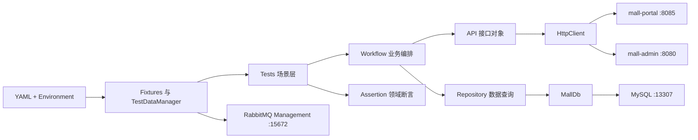

# 架构说明

## 设计目标

测试场景只表达业务步骤和断言，不在测试文件中拼 URL、Token、SQL 或跨端流程。框架按职责拆为六层，避免随着场景增加形成单文件脚本。

## 分层职责

| 层 | 责任 | 禁止事项 |
| --- | --- | --- |
| API | 定义现有接口路径、参数和响应契约 | 不编排跨接口业务，不直接查库 |
| Workflow | 组合购物车、订单、退货的可复用步骤 | 不写 SQL，不读取环境变量 |
| Repository | 查询数据库事实；TestDataManager 受控写入测试数据 | 普通 Repository 不修改业务数据 |
| Assertion | 业务码、金额、库存和订单一致性断言 | 不发请求，不产生测试数据 |
| Fixture | 客户端登录、依赖注入、场景前后清理 | 不依赖用例执行顺序 |
| Test data | 专用会员、地址、商品与恢复策略 | 不复用人工账号和随机线上数据 |

## 关键类型

- `Settings`：把 YAML 默认值与环境变量覆盖转换为强类型配置，并集中检查必需凭据。
- `OrderContext`：保存一次订单链路中的订单、购物车、商品、SKU、地址和金额信息。
- `StockSnapshot`：用不可变快照比较 `stock` 与 `lock_stock` 的前后变化。
- `ReturnContext`：保存退货申请编号、金额和订单关联信息。

## HTTP 与证据

`HttpClient` 统一处理请求超时、HTTP 状态、JSON 解析、业务响应和日志。请求头、Token、密码等敏感字段在日志和 Allure 附件中脱敏。接口成功并不等于业务正确，因此场景会根据风险继续验证数据库、金额公式、库存变化或操作历史。

## 环境边界

本仓库不复制 mall 源码。`bootstrap` 将源码克隆到被忽略的 `.sut/mall`，校验 commit 后构建 JAR，再挂载进 Compose 的 Java 17 容器。这样可以复现被测版本，同时避免把第三方源码、JAR 和数据库卷提交到测试仓库。
