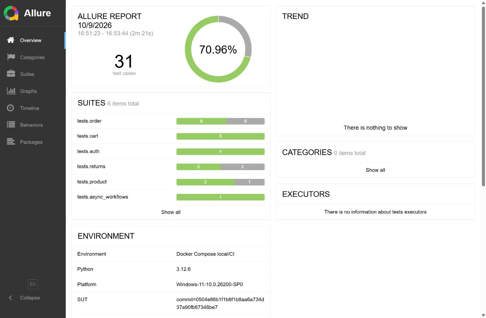
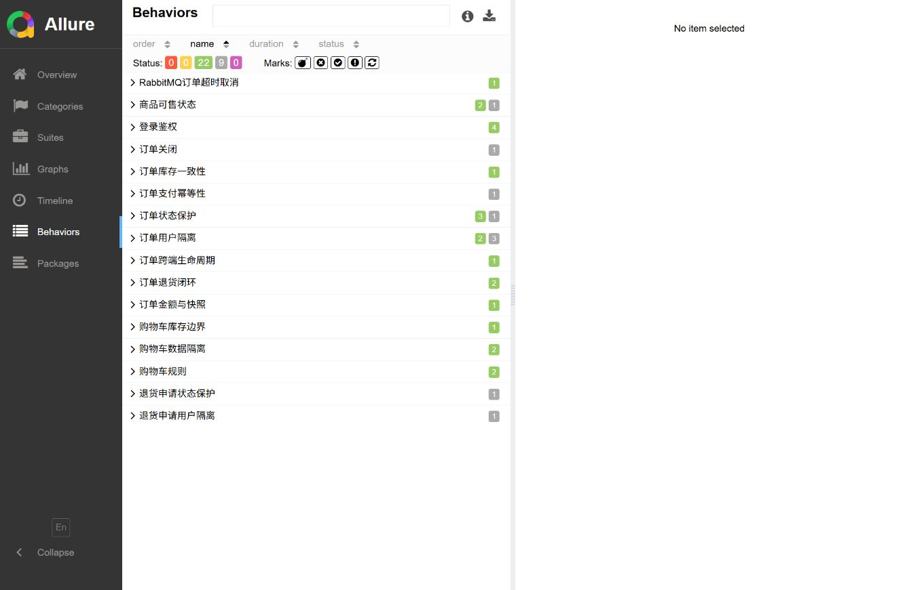

# 实测结果

本页记录 2026-10-09 的收尾验证，不将早期版本统计当作当前结果。

## 执行环境

- Windows 本地宿主机，Python 3.12、Java 17、Maven、Docker Desktop。
- Compose：MySQL 5.7、Redis 7、MongoDB 5、RabbitMQ 3.10.5、mall-admin、mall-portal。
- 被测源码：`macrozheng/mall@0504e86b1f1b6f1b8aa6a734d37a90fb67346be7`。
- Allure CLI：2.24.0。

## 功能回归

非 slow 回归按默认顺序和逆序各运行一次，结果一致：

```text
21 passed, 9 xfailed, 1 deselected
```

9 个 xfail 是 6 类已确认缺陷产生的测试实例，不计为通过。完整测试收集为 31 个实例。新发现 GH-7 后台关闭未释放锁定库存，已保留复现及源码证据。

包含 RabbitMQ 慢场景的完整回归：

```text
22 passed, 9 xfailed in 145.89s
```

慢场景临时将订单超时设为 1 分钟，通过真实 RabbitMQ 消息和轮询验证取消及锁定库存释放，随后恢复执行前的设置。清理专用延迟队列避免旧长延迟消息导致队头阻塞。

普通回归两轮耗时分别为 81.54 秒和 79.78 秒。耗时为当次本地环境观测值，不构成执行时长保证。

框架自测在 Windows PowerShell 5.1 与 PowerShell 7 环境验证失败退出，连同脱敏、写入保护、性能业务断言及 xfail 行为：`35 passed`。这些自测不计入 31 个电商业务实例；Linux CI 只有 PowerShell 7，实例数会少 4 个。

只读数据检查结果：专用购物车/订单/退货记录均为 0；商品为上架状态；SKU `stock=500`、`lock_stock=0`；延迟队列消息为 0；订单超时恢复为执行前的 120 分钟。

## Locust 基线

```text
users: 20
spawn rate: 2 users/s
duration: 2 minutes
requests: 2190
failures: 0
throughput: 19.11 req/s
aggregate average: 8.89 ms
aggregate P95: 14 ms
maximum: 159.94 ms
```

统计包含 20 次登录和商品搜索、详情、购物车读取。搜索/详情/购物车 P95 分别为 12/14/8ms，登录 P95 为 160ms。每个请求同时校验 HTTP、业务码及关键数据；不把 HTTP 200 自动计为业务成功。

该数字来自单机本地 Docker 环境，只作为后续变更的对照基线，不代表生产容量，也未证明并发下单、真实支付、资源瓶颈或长时间稳定性。

## 报告截图





截图来自本轮完整回归：31 个实例、22 passed、9 skipped（pytest 的已确认缺陷 XFAIL）、0 failed、0 broken。历史 PNG 只保留作旧版记录，不作为当前统计依据。

GitHub Actions 中保存 Allure 原始结果、HTML 和容器日志，避免仅保留截图而丢失可审计证据。
