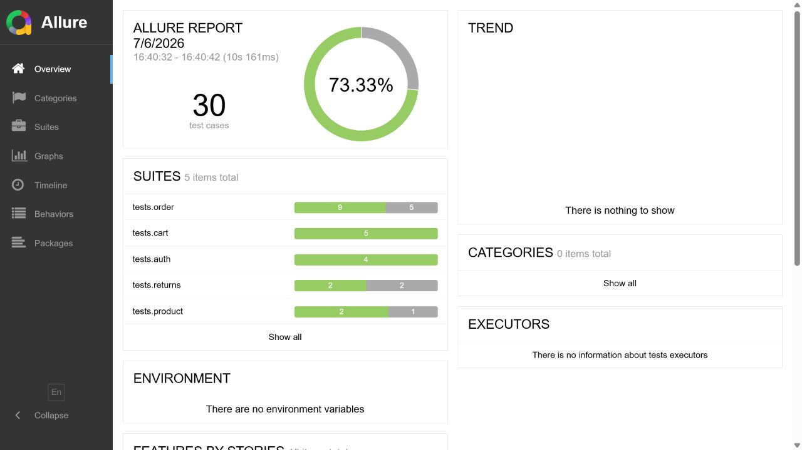
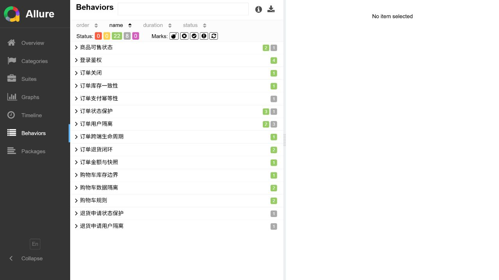

# 实测结果

## 执行环境

- Windows 本地宿主机，Python 3.12、Java 17、Maven、Docker Desktop。
- Compose：MySQL 5.7、Redis 7、MongoDB 5、RabbitMQ 3.10.5、mall-admin、mall-portal。
- 被测源码：`macrozheng/mall@0504e86b1f1b6f1b8aa6a734d37a90fb67346be7`。
- Allure CLI：2.24.0。

## 功能回归

非 slow 回归连续执行两次结果一致。完成 RabbitMQ 队列治理后的最终执行为：

```text
22 passed, 8 xfailed, 1 deselected
```

8 个 xfail 是 5 类已确认缺陷产生的测试实例，不计为通过。完整测试收集为 31 个实例。

RabbitMQ 慢场景独立执行：

```text
1 passed, 30 deselected in 61.13s
```

首次调试发现延迟队列存在普通 60 分钟消息，1 分钟测试消息因队头过期顺序被阻塞。最终在测试数据治理层清理专用延迟队列后，自动取消和锁定库存释放均按预期完成。

## Locust 基线

```text
users: 20
spawn rate: 2 users/s
duration: 2 minutes
requests: 2167
failures: 0
throughput: 18.97 req/s
aggregate average: 5 ms
aggregate P95: 7 ms
maximum: 182 ms
```

该数字来自单机本地 Docker 环境，只作为后续变更的对照基线，不代表生产容量。

## 报告截图





GitHub Actions 中保存 Allure 原始结果、HTML 和容器日志，避免仅保留截图而丢失可审计证据。
